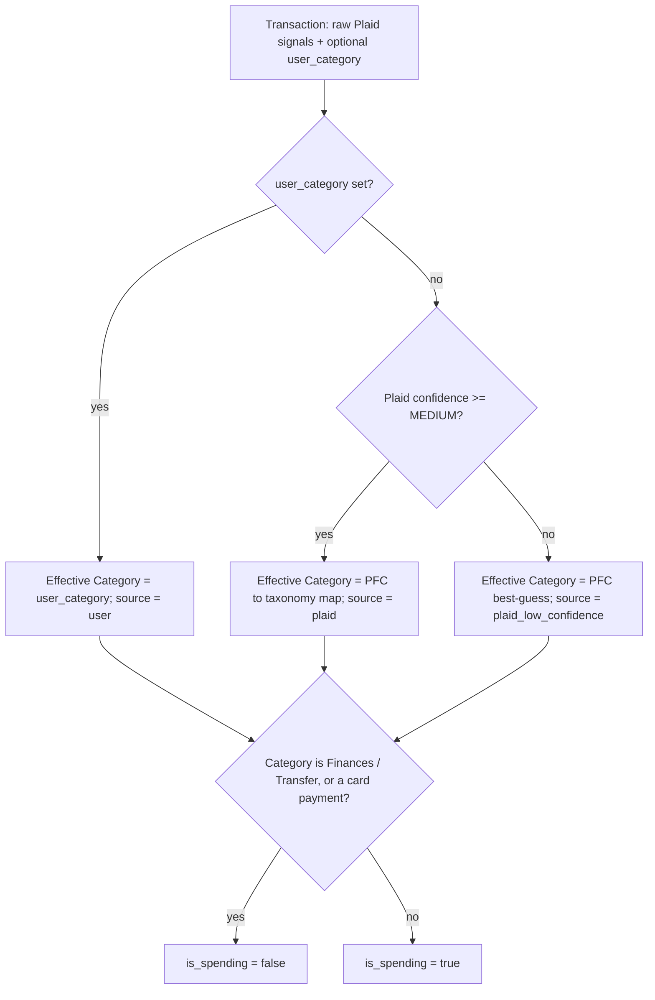

# Spending view

## Problem Statement

The holder can see account balances and net worth in Guru, but nothing about
where their money actually goes. To understand spending they have to open each
credit-card provider (Tangerine, Wealthsimple) separately, and neither shows a
combined, categorized picture of a month's spending or how it compares to
recent months.

## Solution

A Spending view that pulls the holder's credit-card Transactions from Plaid and,
for a chosen month in the last 12, shows: a headline net total, spending pace
across the month against a 3-month average, and a Category breakdown (front and
centre) that expands into Subcategories. Every Transaction is always categorized
automatically; low-confidence assignments are flagged in the UI for review, and
any Transaction can be reassigned by hand, with that choice sticking across
syncs and visibly marked as a manual edit.

## User Stories

1. As the holder, I want my credit-card Transactions pulled from Plaid during Sync, so that the Spending view reflects my real charges without manual entry.
2. As the holder, I want to pick any month in the last 12, so that I can review that month's spending.
3. As the holder, I want a headline net total for the selected month, so that I know what I spent.
4. As the holder, I want a cumulative line of spending across the selected month compared against my 3-month average pace, so that I can see whether I'm spending faster than usual.
5. As the holder, I want a Category breakdown front and centre - a treemap plus a ranked list with amount, share, and Transaction count - so that I can see where my money went.
6. As the holder, I want to expand a major Category into its Subcategories, so that I can see the finer breakdown.
7. As the holder, I want each Transaction categorized automatically, so that I don't have to sort most of them by hand.
8. As the holder, I want Transactions Plaid assigned with low confidence flagged in the UI, so that I know which auto-assignments to double-check.
9. As the holder, I want to reassign any Transaction's Category, so that the breakdown reflects reality when the automatic guess is wrong or ambiguous.
10. As the holder, I want my manual assignment to stick across future Syncs, so that I don't have to redo it.
11. As the holder, I want a label on a Transaction whose Category I set manually, so that I can tell my own choices apart from the automatic ones.
12. As the holder, I want refunds to net against their Category's spending, so that the totals reflect what I actually spent.
13. As the holder, I want card payments and transfers shown under Finances but not counted as spending, so that paying my bill doesn't inflate what I "spent."
14. As the holder, I want bank fees and cash withdrawals counted as spending under Finances, so that real costs aren't hidden.
15. As the holder, I want pending charges included and marked pending, so that my total reflects committed spending and I know which are not yet posted.
16. As the holder, I want the selected month's Transactions listed grouped by day, so that I can scan and review them.
17. As the holder, I want to reach Spending from the app nav, so that I can switch between Accounts and Spending.

## Architecture

Effective Category resolution and the spending/non-spending decision (ADR 0001,
derive at read time) run in the backend read path. The frontend derivation seam
only aggregates the resolved Transactions.

## Implementation Decisions

### Data model
- New **Transaction** entity, one row per Plaid transaction, belonging to an Account. Stores the raw Plaid signals needed to recompute the Effective Category - Plaid category (primary + detailed), confidence level, merchant name, raw name, amount, date, pending flag, Plaid transaction id, the linking pending-transaction id - plus a nullable `user_category` (the sticky manual assignment). No derived Category column (ADR 0001).
- **Institution** gains a nullable transactions cursor so Sync can request deltas.
- Money stored as `Decimal` in the DB, emitted as integer cents over the API (matches the existing Account convention). Amount sign follows Plaid: positive = outflow (spending), negative = inflow (refund/credit).
- Atlas migration adds the Transaction table and the Institution cursor column.

### Sync (extends the existing `POST /api/sync` flow)
- `PlaidService` gains a cursor-based transactions sync returning added / modified / removed batches and the next cursor.
- `sync_all` pulls Transactions per Institution after accounts: apply added/modified as upserts keyed by Plaid transaction id, apply removed as deletes, then persist the next cursor. First Sync backfills ~13 months; later Syncs apply only deltas. The pending -> posted lifecycle arrives as Plaid deltas and is applied as-is.

### Categorization (read-time, ADR 0001)
- A single fixed taxonomy config is the source of truth: the major Categories and their Subcategories, each major including an **Other**, plus **Finances** (Bank fees & interest, Cash withdrawals, Transfers), and **Miscellaneous**.
- A static Plaid-category -> taxonomy map. Where Plaid identifies only the major, land in that major's Other. Indistinguishable Subcategories (e.g. auto insurance) default to Other pending a manual assignment.
- Effective Category resolves by first opinion: `user_category` -> Plaid map (always applied; confidence below MEDIUM sets source = `plaid_low_confidence`). A Transaction is non-spending when its Category is Finances / Transfer or it is a card payment; everything else (including fees, cash withdrawals) counts.

### API contracts
- `GET /api/transactions?start=&end=` - Credit Card, CAD Transactions in the date range (default: the last ~13 months). Each carries: id, account_id, date, merchant name, amount (signed integer cents), pending, Effective Category (major + subcategory), category source (`user` | `plaid` | `plaid_low_confidence`), and is_spending.
- `PATCH /api/transactions/{id}` with a Category (major + subcategory) sets `user_category`; with a null Category clears it and reverts to the auto-derived Category. Returns the updated Transaction (source becomes `user`, or reverts).
- `GET /api/categories` - the canonical taxonomy (majors, their Subcategories including Other) for the category picker and for validating overrides. The frontend maps these to icons/colours; the taxonomy itself has one source.

### Frontend
- New `/spending` route and a "Spending" tab in the app nav alongside "Accounts".
- A pure `deriveSpending` function (mirrors `deriveDashboard`): given the raw Transactions and a selected month, it produces the view model - headline net total, cumulative daily series, 3-month average-pace comparison, Category breakdown (majors with amount/share/count, expandable to Subcategories), and the day-grouped Transaction list. Transfers are excluded from totals and the treemap but remain in the list.
- The Spending view renders the treemap + breakdown + chart + day-grouped list. Each row in the list shows a dedicated icon for its Category, a Category picker (major -> subcategory) that issues the PATCH, and a manual-edit label when category source is `user`. Rows with source `plaid_low_confidence` show a low-confidence flag. Amounts are CAD-formatted.

## Testing Decisions

A good test asserts only externally observable behaviour - backend tests through
API responses, frontend tests through the derived view model - never the PFC map
or resolver internals directly, only their outcomes.

### Backend - HTTP seam (existing)
Prior art: `backend/tests/test_sync_accounts.py`, driving `TestClient` over
`create_app` with Plaid faked via the `get_plaid_service` override
(`backend/tests/conftest.py`). Extend `FakePlaidService` with a transactions
sync and add a `plaid_transaction` helper alongside `plaid_account`. Tests, all
asserted through `POST /api/sync` then `GET`/`PATCH /api/transactions`:
- Sync persists Credit Card Transactions with amount, date, merchant, pending.
- Categorization precedence: a confident Plaid category maps to the taxonomy with source `plaid`; a low/unknown-confidence Transaction maps with source `plaid_low_confidence`; a `user_category` override wins over both.
- Spending classification: a transfer / card payment is is_spending = false and excluded from spending; a bank fee and a cash withdrawal count; a refund carries a negative amount and nets its Category down.
- A PATCH override is reflected in the response, marked source = `user`, and survives a subsequent Sync.
- `GET /api/transactions` returns only Credit Card, CAD Transactions within the requested range.

### Frontend - derivation seam (existing pattern)
Prior art: `frontend/src/dashboard/deriveDashboard.test.ts`, pure over fixtures,
no network. Tests for `deriveSpending`:
- Month filter selects only the chosen month's Transactions.
- Net total nets refunds; a Category can go negative.
- Cumulative series and the 3-month average-pace comparison are derived correctly.
- Category breakdown reports per-major amount, share, and count, and expands to Subcategories.
- Transfers are excluded from the total and the treemap but present in the list.
- The manual-edit label flag is surfaced for Transactions whose source is `user`.
- The low-confidence flag is surfaced for Transactions whose source is `plaid_low_confidence`.

## Taxonomy

The fixed category set. Every major has an **Other** subcategory for transactions that belong to the major but no specific subcategory. The PFC map targets specific subcategories where possible; ambiguous signals land in Other.

| Major | Subcategories |
|---|---|
| Food and personal items | Restaurants; Groceries and personal items; Other |
| Shopping | Clothing; Gifts; Home and auto; Other |
| Transportation | Auto insurance; Gas, parking, and tolls; Public transit, taxis, and rideshares; Other |
| Bills | Subscriptions; Internet and phone; Utilities; Other |
| Health and wellness | Fitness and sports; Medical; Other |
| Housing | Mortgage; Home insurance; Property taxes; Other |
| Travel | Flights; Hotels; Other |
| Fun money | Activities; Other |
| Finances | Bank fees and interest; Cash withdrawals; Transfers; Other |
| Miscellaneous | *(no subcategories - terminal category, chosen deliberately)* |

**Finances** is the only major where `is_spending` varies by subcategory: Transfers is `is_spending = false`; Bank fees and interest and Cash withdrawals are `is_spending = true`.

## Out of Scope

- Merchant breakdown view / the Category-vs-Merchant toggle.
- Remembered per-merchant overrides (auto-applying a manual choice to future Transactions from the same merchant).
- Interac e-Transfer handling and any spending from chequing / savings Accounts; the view is Credit Card only.
- A per-card filter (Tangerine vs Wealthsimple are combined).
- A 12-month trend chart (the chart is cumulative within the selected month).
- A Household / Personal toggle (Guru is single-user).
- Non-CAD currencies.
- Editing the taxonomy; the set of Categories is fixed.

## Further Notes

**Preserved behaviour** (unchanged, not restated as new work): the Accounts view,
asset/liability and net-worth totals, and the account/balance Sync all behave as
today. Sync additionally pulls Transactions.

- Miscellaneous is a deliberate terminal Category, not a fallback for uncertainty; low-confidence assignments still get a Plaid-derived Category.
- Respects ADR 0001: no derived Category is stored; only raw Plaid signals and the manual override persist.
